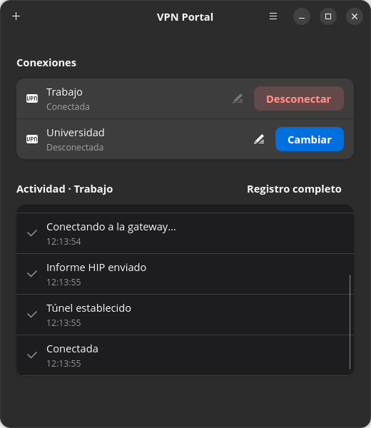
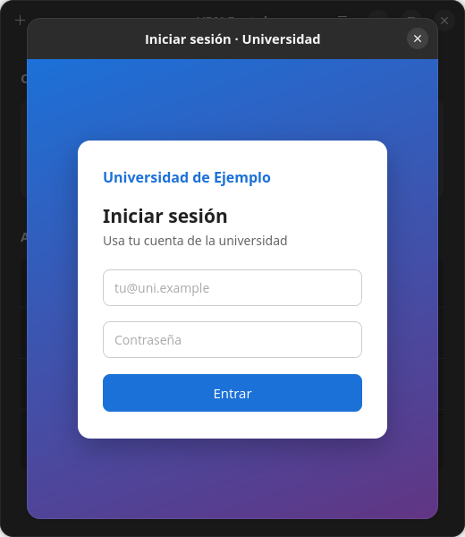
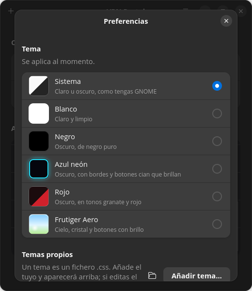
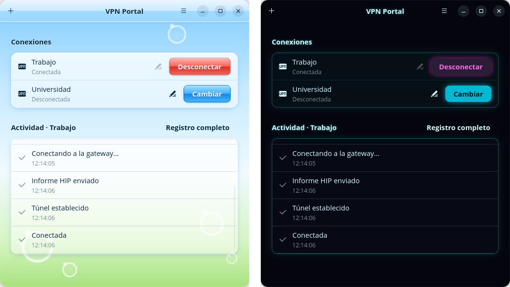

# VPN Portal

*[Read in English](README.md)*

Una pequeña app de GNOME para gestionar tus VPN de **GlobalProtect** en Linux,
construida sobre [GlobalProtect-openconnect](https://github.com/yuezk/GlobalProtect-openconnect)
(`gpclient`).

<p align="center"></p>

- Añade todas las VPN que quieras (portal, gateway, usuario, HIP) y conecta o
  desconecta cada una con un clic.
- **Login SAML dentro de la app**: la página de tu proveedor de identidad
  (Microsoft, Okta, el SSO de tu universidad…) se abre en un diálogo dentro de
  la ventana, no en una ventana aparte.
- **Recuerda tu sesión**: si tu proveedor de identidad te mantiene la sesión
  iniciada, el siguiente login pasa solo sin enseñar nada.
- **Icono en la barra superior** con el estado actual y un menú para conectar
  o desconectar. Al cerrar la ventana, la app sigue en segundo plano, y puede
  arrancar sola (oculta en la barra) al iniciar sesión.
- **Actividad clara**: los pasos de cada conexión en lenguaje normal
  ("Contactando con el portal…", "Conectada"), con el registro completo de
  `gpclient` a un clic (y un botón para copiarlo).
- **Temas**: Sistema, Blanco, Negro, Azul neón, Rojo y Frutiger Aero
  (cielo, cristal, burbujas y botones con brillo), en Preferencias (Ctrl+,).
  También puedes **hacer el tuyo**: un tema es solo un fichero `.css`, ver
  [docs/THEMES.es.md](docs/THEMES.es.md).
- **En inglés y en español**, según el idioma de tu sistema o el que elijas
  en Preferencias.
- **Conectar sin contraseña**, sin regalar root (ver [Seguridad](#seguridad)).

> **Estado:** en sus primeras versiones, pero ya sirve para el día a día. En
> inglés y en español. Probada en Ubuntu 26.04 con GNOME 50.

## Capturas

| Inicio de sesión dentro de la app | Preferencias |
|:---:|:---:|
|  |  |

Temas: Frutiger Aero y Azul neón.



## Requisitos

- [GlobalProtect-openconnect](https://github.com/yuezk/GlobalProtect-openconnect)
  2.x instalado (`gpclient` en `/usr/bin`).
- GTK 4, libadwaita ≥ 1.6 y WebKitGTK 6.0. En Ubuntu/Debian:

  ```bash
  sudo apt install meson ninja-build pkg-config gettext libadwaita-1-dev libwebkitgtk-6.0-dev
  ```
- Para el icono de la barra superior en GNOME, la
  [extensión AppIndicator](https://extensions.gnome.org/extension/615/appindicator-support/)
  (viene activada en Ubuntu). Sin ella la app funciona, pero cerrar la ventana
  la cierra.

## Compilar e instalar

```bash
meson setup build
meson compile -C build
sudo meson install -C build
```

Instala, en `/usr/local`: la app, su lanzador e icono (aparece en el menú de
aplicaciones de GNOME), las traducciones, y las dos piezas de sistema que
necesita para conectar sin contraseña: un pequeño script (el helper) y una
regla de sudo (ver [Seguridad](#seguridad)). La regla de sudo se comprueba
con `visudo` antes de instalar nada.

La regla es para el grupo `sudo` (Debian/Ubuntu). En Fedora o Arch, configura
con `meson setup build -Dsudo_group=wheel`.

Para desinstalar: `sudo ninja -C build uninstall`. Más detalles en
[system/README.md](system/README.md).

## Uso

Abre **VPN Portal** desde el menú de aplicaciones (o ejecuta `vpnportal`) y
pulsa **+** para añadir una VPN. La primera vez que conectas a un portal o
gateway nuevo, GNOME te pide la contraseña de administrador una vez para
aprobarlo; a partir de ahí, conectar nunca la vuelve a pedir.

### Probarla sin VPN

`tools/demo.sh` arranca una copia de demostración de la app con dos VPN
inventadas que "conectan" sin red, sin login y sin GlobalProtect instalado
(solo necesita las dependencias de compilación). Tu configuración real no se
toca.

```bash
tools/demo.sh
```

## Cómo funciona

```
VPN Portal ──sudo -n──> vpnportal-helper ──> gpclient (root)
     ^                                          │ necesita login SAML
     │ D-Bus                                    v
     └───────────────────────────────── vpnportal-auth (tu usuario)
```

- El helper valida cada argumento y lanza `gpclient connect`.
- Cuando `gpclient` necesita un login SAML, lanza su programa de login. El
  helper le indica (`GP_AUTH_BINARY`) que use `vpnportal-auth` en vez de
  `gpauth`.
- `vpnportal-auth` le pasa la petición a la app por D-Bus. La app muestra el
  login en un navegador embebido (WebKitGTK), captura las credenciales que
  devuelve el portal (cabeceras HTTP, HTML o URL `globalprotectcallback:`,
  igual que `gpauth`) y se las devuelve a `gpclient`.

## Seguridad

- La regla de sudo solo permite `vpnportal-helper connect *` sin contraseña.
- `connect` solo acepta un conjunto fijo de opciones y valida cada valor. Las
  opciones peligrosas de `gpclient` (`-s <script>`, `--hip <script>`,
  `--cookie-cache <ruta>`, certificados…) no se pueden pasar de ninguna forma.
- `connect` solo conecta a servidores **aprobados**
  (`/etc/vpnportal/allowed-hosts`). Aprobar un servidor (`allow`) siempre pide
  tu contraseña, así que un programa malicioso que corra con tu usuario no
  puede desviar tu VPN a un servidor suyo.
- La app solo atiende peticiones de login de conexiones que ha lanzado ella.

## Próximamente

Más idiomas: las traducciones están en [po/](po/). Para añadir uno, pon su
código en `po/LINGUAS` y crea `po/<código>.po` (por ejemplo con
`msginit -i po/vpnportal.pot -l fr`, después de
`meson compile -C build vpnportal-pot`). Ver [TODO.md](TODO.md).

## Licencia

[GPL-3.0 o posterior](LICENSE).

Este proyecto no está afiliado ni respaldado por Palo Alto Networks.
GlobalProtect es una marca registrada de Palo Alto Networks, Inc.
